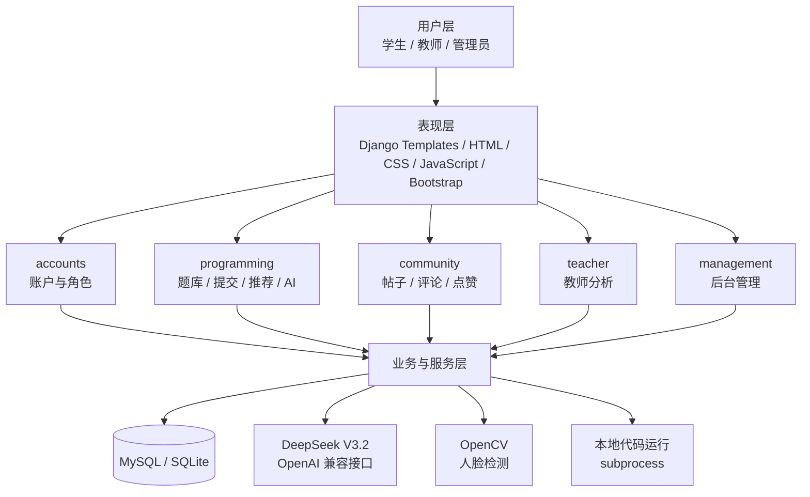
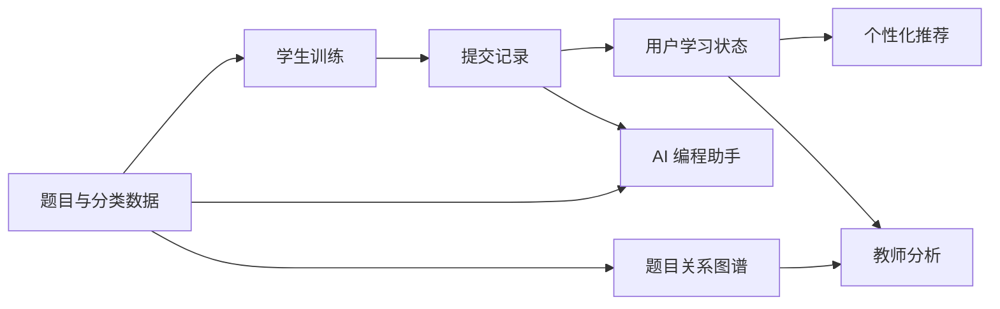
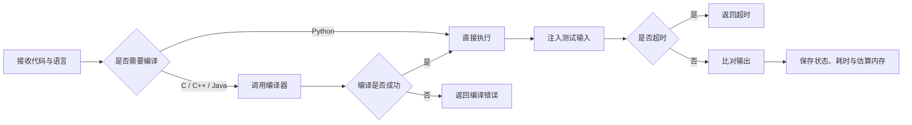
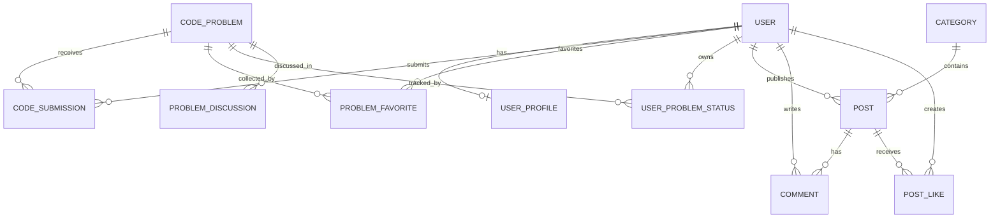

<div align="center">

# CodeGaze

### 基于大模型与题目关系图谱的智能编程学习与教学分析平台

面向高校编程教学场景，融合在线训练、代码评测、AI 编程辅导、个性化推荐、教师分析、社区交流与考试过程监测。

[](https://www.python.org/)
[](https://www.djangoproject.com/)
[](https://www.mysql.com/)
[](#ai-编程助手)
[](https://www.docker.com/)
[](https://railway.app/)
[](https://github.com/hongzhong132/CodeGaze/stargazers)

[项目介绍](#项目介绍) · [核心功能](#核心功能) · [技术实现](#核心技术实现) · [快速启动](#快速启动) · [项目成果](#项目成果)

</div>

---

## 项目介绍

CodeGaze 是一个面向高校程序设计课程、算法训练与编程考核场景的智能编程学习平台。

项目围绕：

> **题目浏览 → 在线作答 → 代码运行与提交 → 结果反馈 → AI 辅导 → 个性化推荐 → 教师分析与教学干预**

构建完整学习闭环，并支持学生、教师、管理员三类角色。

平台当前收录约 **200 道编程题**，支持 **C、C++、Java、Python** 四种语言，提供练习模式与考试模式。系统使用 Django 多应用架构组织账户、编程训练、社区、教师分析与后台管理等业务，并通过 OpenAI 兼容接口接入硅基流动平台的 DeepSeek 模型。

> 本项目为竞赛与教学场景原型。代码运行模块目前在本地环境中通过 `subprocess` 执行，不属于生产级安全沙箱，正式部署前需要进一步增加容器隔离、权限限制与资源配额。

---

## 项目演示

- **GitHub 仓库：** https://github.com/hongzhong132/CodeGaze
- **演示视频（GitHub Release）：** 已上传release
- **演示视频（备用网盘）：** https://pan.baidu.com/s/13jbOqzdOE2Nq76Bcau5MhA
- **在线演示：** 项目曾通过 Docker 部署至 Railway，并配置 Railway MySQL 数据库；云端实例存在冷启动延迟
- **演示账号：** 上传演示视频或重新开放服务后补充

<!--
TODO:
1. 在 GitHub Releases 上传作品演示视频。
2. 将上方“上传后补充”替换为真实链接。
3. 若 Railway 服务重新开放，在此补充访问地址与只读演示账号。
-->

---

## 项目成果

- **2026 年中国大学生计算机设计大赛中南赛区一等奖（省级一等奖，软件开发类）**
- 计算机软件著作权已提交申请
- 大学生创新创业训练计划项目已申报，计划于 2027 年结项
- 完成 Docker 化与 Railway 公网部署实践
- 完成从需求分析、系统设计、编码实现、数据库配置到竞赛展示的完整开发流程

---

## 个人贡献

项目由 5 人团队共同完成，本人担任 **项目负责人兼核心全栈开发者**：

- 负责需求分析、系统架构、任务分配与开发进度推进
- 独立完成软件系统的代码开发，包括前端页面、Django 后端、数据库、AI 接口、推荐逻辑、教师分析及考试监测模块
- 负责功能测试、环境配置、Docker 与 Railway 部署
- 协调其他成员完成项目文档、展示 PPT、介绍视频和竞赛材料

---

## 核心功能

### 学生端

- 统一登录与角色自动分流
- 题库分区、关键词搜索、标签与难度筛选
- 题目详情、收藏与学习状态记录
- 练习模式与考试模式切换
- 在线代码编辑、快速运行与正式提交
- C、C++、Java、Python 多语言运行
- 固定测试样例与自定义输入
- 编译错误、运行错误、超时和结果反馈
- 提交记录、运行耗时与估算内存展示
- AI 题意解释、代码分析、Bug 定位与优化建议
- 补弱、稳固、进阶三类个性化推荐
- 社区发帖、评论、点赞与经验交流

### 教师端

- 班级训练数据总览
- 学生列表与个人学习画像
- 分区掌握度、通过率和覆盖率统计
- 能力雷达图与薄弱方向识别
- 高风险题目分析
- 题目关系图谱与教学建议
- 推荐结果与教学干预参考

### 管理与考试辅助

- Django 后台题目和用户管理
- JSON 题库批量导入
- 考试模式下禁用 AI 助手
- OpenCV 正脸、侧脸和多人状态检测原型
- 摄像头状态、检测结果与接口耗时展示

---

## 系统架构



### 数据流



---

## 技术栈

| 分层 | 技术 |
|---|---|
| 后端框架 | Python、Django |
| 页面与交互 | Django Templates、HTML5、CSS3、JavaScript、Bootstrap |
| 数据存储 | MySQL、SQLite、Django ORM |
| AI 能力 | OpenAI Python SDK、硅基流动、DeepSeek V3.2 |
| 代码评测 | `subprocess`、GCC / G++ / JDK / Python |
| 计算机视觉 | OpenCV、Haar Cascade |
| 部署 | Docker、Railway |
| 工程工具 | Git、GitHub、环境变量、日志、JSON 导入脚本 |

> 当前仓库使用 Django Templates 作为主要表现层，不依赖独立 Vue 3 前端。

---

## 核心技术实现

### 1. Django 多应用架构

系统按照业务边界拆分为 5 个主要 Django 应用：

```text
accounts     用户资料、角色与登录分流
programming  题目、提交、评测、推荐、AI 助手与考试监测
community    分类、帖子、评论与点赞
teacher      教师首页、学生画像与题目分析
management   题目维护与系统运营
```

该结构将账户、训练、社区、教学分析和管理能力解耦，便于继续扩展判题、推荐、排行榜与教学看板。

---

### 2. 多语言代码运行与结果反馈

代码运行模块支持：

- Python 直接解释执行
- C / C++ 编译后执行
- Java 编译后执行
- 固定测试样例与自定义输入
- 运行超时控制
- 编译错误、运行错误和超时捕获
- 保存运行耗时与估算内存数据

执行流程：



#### 安全说明

当前评测模块主要用于本地开发和竞赛演示，尚未使用 Docker 沙箱隔离每次代码执行。生产化需要补充：

- 独立容器或沙箱
- CPU、内存和进程数限制
- 文件系统与网络访问限制
- 危险系统调用拦截
- 任务队列与并发控制

---

### 3. AI 编程助手

AI 助手通过 OpenAI 兼容接口接入硅基流动中的 DeepSeek 模型。

系统不会只发送用户的一句话，而是根据当前题目场景组合：

- 题目名称与难度
- 题目描述
- 输入输出格式
- 数据范围和样例
- 用户当前选择的编程语言
- 用户编辑器中的代码
- 用户提出的问题

为避免上下文过长，系统会对题目文本、样例和代码进行长度裁剪，并使用环境变量管理 API 地址、模型名称与密钥。

支持的高频操作：

- 解释题意
- 分析当前代码
- 定位 Bug
- 给出优化建议

当前 AI 模块定位为 **场景化编程问答助手**，主要优势是与当前题目、代码和语言上下文绑定；暂未引入模型微调、复杂 RAG 或自主 Agent 工作流。

在考试模式下，系统会关闭 AI 助手，避免影响独立作答。

---

### 4. 个性化推荐

推荐模块基于用户真实训练数据构建规则评分，主要使用：

- 题目难度
- 推荐阶段与推荐权重
- 用户尝试次数
- 用户错误次数
- 题目通过状态
- 分区通过率
- 分区覆盖率
- 当前薄弱方向
- 是否适合补弱、提升或挑战

系统生成三类学习路径：

| 推荐类型 | 目标 |
|---|---|
| 优先补强 | 优先处理累计错误较多或尚未掌握的薄弱方向 |
| 继续稳固 | 巩固已接触但掌握度仍不稳定的知识点 |
| 可以进阶 | 根据优势分区和已通过情况推荐更高难度题目 |

推荐结果会同时返回可解释原因，例如：

> 你在该分区累计出错次数较多，建议优先完成该题以补强薄弱点。

---

### 5. 教师分析与题目关系图谱

教师端复用学生训练、提交和推荐数据，形成：

- 班级训练概览
- 学生个人画像
- 尝试数、通过数、错误数和通过率
- 分区掌握度与覆盖率
- 能力雷达图
- 薄弱分类和高风险题目
- 推荐概览与教学建议
- 题目关系可视化

当前“知识图谱”采用结构化字段与关系可视化实现，主要服务于题目关联展示和教学分析，未使用 Neo4j 等专用图数据库。

---

### 6. OpenCV 考试监测原型

考试模式集成 OpenCV 人脸检测原型：

- 正脸检测
- 侧脸检测
- 多人状态提示
- 摄像头连接状态
- 检测后端状态
- 接口耗时展示

该模块属于过程辅助原型，不用于身份识别，也不能替代正式考试监考系统。

---

## 项目目录

```text
CodeGaze/
├── accounts/                     # 用户、资料与角色分流
├── codegaze/                     # Django 全局配置
├── community/                    # 分类、帖子、评论和点赞
├── management/                   # 管理功能
├── programming/                  # 题目、提交、评测、AI、推荐与监测
│   ├── services/                 # AI、推荐等服务逻辑
│   └── utils/                    # 代码运行等工具
├── teacher/                      # 教师端统计与教学分析
├── templates/                    # Django 页面模板
├── static/                       # CSS、JavaScript 与静态资源
├── media/                        # 用户媒体文件（不提交仓库）
├── scripts/                      # 辅助脚本
├── import_problems_enhanced.py   # 题库批量导入
├── problems_data_enhanced.json   # 题目数据
├── manage.py
├── requirements.txt
├── .env.example
├── Dockerfile
└── README.md
```

---

## 数据模型概览



---

## 快速启动

### 1. 克隆仓库

```bash
git clone https://github.com/hongzhong132/CodeGaze.git
cd CodeGaze
```

### 2. 创建虚拟环境

#### Windows

```bash
python -m venv .venv
.venv\Scripts\activate
```

#### Linux / macOS

```bash
python3 -m venv .venv
source .venv/bin/activate
```

### 3. 安装依赖

```bash
pip install -r requirements.txt
```

### 4. 配置环境变量

复制示例文件：

```bash
cp .env.example .env
```

Windows PowerShell：

```powershell
Copy-Item .env.example .env
```

参考配置：

```env
DJANGO_SECRET_KEY=replace_with_your_secret_key
DJANGO_DEBUG=True
DJANGO_ALLOWED_HOSTS=127.0.0.1,localhost

CODEGAZE_DB_ENGINE=django.db.backends.mysql
CODEGAZE_DB_NAME=codegaze_db
CODEGAZE_DB_USER=root
CODEGAZE_DB_PASSWORD=replace_with_your_password
CODEGAZE_DB_HOST=127.0.0.1
CODEGAZE_DB_PORT=3306

AI_ASSISTANT_PROVIDER=siliconflow
OPENAI_API_KEY=replace_with_your_api_key
OPENAI_BASE_URL=your_openai_compatible_base_url
AI_ASSISTANT_MODEL=your_deepseek_model_id
AI_ASSISTANT_TIMEOUT=60
```

> `AI_ASSISTANT_MODEL` 请填写硅基流动控制台中实际可用的 DeepSeek V3.2 模型标识。

如暂时不配置真实 API，可启用项目中的 demo 模式。demo 模式只验证调用链路，不会生成真实 AI 回复。

### 5. 创建 MySQL 数据库

```sql
CREATE DATABASE codegaze_db
CHARACTER SET utf8mb4
COLLATE utf8mb4_unicode_ci;
```

也可以在本地开发时切换为 SQLite。

### 6. 数据库迁移

```bash
python manage.py makemigrations
python manage.py migrate
```

### 7. 导入题目数据

```bash
python import_problems_enhanced.py
```

### 8. 创建管理员账号

```bash
python manage.py createsuperuser
```

### 9. 启动服务

```bash
python manage.py runserver
```

访问：

```text
http://127.0.0.1:8000/
```

---

## Docker 运行

### 构建镜像

```bash
docker build -t codegaze .
```

### 启动容器

```bash
docker run --env-file .env -p 8000:8000 codegaze
```

项目曾使用 Docker 部署到 Railway，并连接 Railway MySQL 数据库。免费或低配实例可能存在冷启动和网络延迟。

---

## 开发环境要求

- Python 3.10+
- MySQL 5.7 / 8.0，或 SQLite
- GCC / G++（运行 C、C++）
- JDK（运行 Java）
- Git
- 可选：Docker

---

## 已知限制

- AI 助手响应速度受模型平台、网络和上下文长度影响
- 当前 AI 能力属于题目场景增强问答，与通用 DeepSeek 对话能力接近
- 题库规模约 200 道，仍需持续扩充题目质量、标签和测试样例
- 本地代码执行未使用独立 Docker 沙箱，不适合直接用于公开生产环境
- 内存数据为估算或近似值，不等同于严格资源监控结果
- OpenCV 监测属于人脸状态检测原型，准确性与稳定性仍需提高
- 当前测试体系以功能验证为主，自动化测试覆盖率需要继续提升
- Railway 云端实例可能存在冷启动延迟

---

## 后续规划

- 使用 Docker 沙箱隔离用户代码运行环境
- 增加 CPU、内存、网络和文件访问限制
- 完善测试用例评测与多组用例判题
- 增加 pytest 自动化测试和 GitHub Actions
- 优化 AI 上下文裁剪、响应速度和多轮对话
- 引入 Redis 缓存与异步任务队列
- 完善教师端班级管理和数据导出
- 扩充高质量题库与知识点关系
- 优化移动端适配
- 增加公开演示环境与只读体验账号

---

## 安全说明

- 不要将 `.env`、数据库密码、Django `SECRET_KEY` 或 API Key 提交到 GitHub
- 生产环境必须关闭 `DEBUG`
- 正确配置 `ALLOWED_HOSTS` 与跨站请求安全策略
- 公开部署前应删除测试账号、日志、本地数据库和用户上传文件
- 用户代码执行必须放入受限沙箱，不能直接授予宿主机权限

---

## 项目时间

```text
2026.01 — 2026.04
```

---

## License

本项目当前未附加开源许可证，主要用于学习、竞赛、科研立项与技术交流。未经许可，请勿用于商业用途。

---

<div align="center">

如果这个项目对你有帮助，欢迎 Star。

</div>
